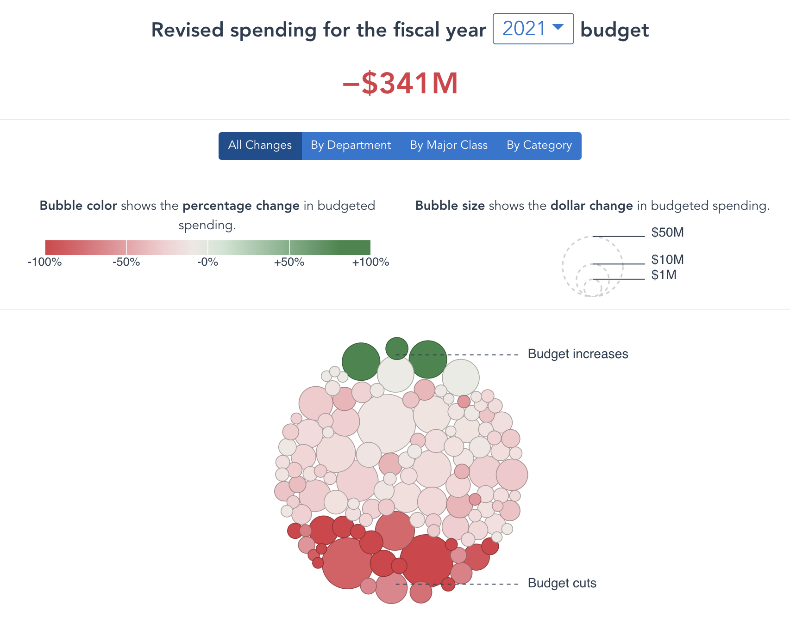
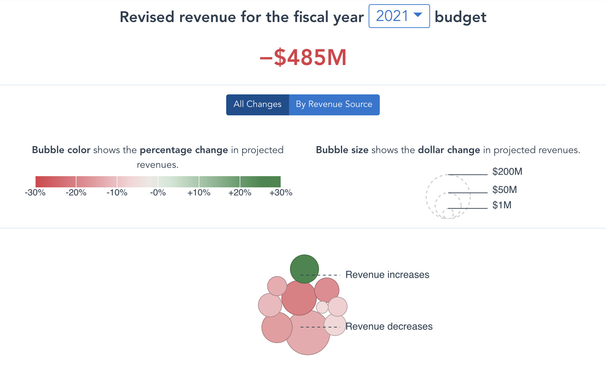

# Visualizing the Revised FY20 - FY25 Budget

The code behind the interactive visualization of Philadelphia's revised FY20-FY25 budget, released May 1, 2020. 

Explore the interactive visualization on the [here](http://phlcontroller.staging.wpengine.com/philadelphia-audits/fy21-fy25-budget-revisions/).




## Tools

The application is built using a combination of open-source tools, including
[vue](https://github.com/vuejs/vue) and [d3](https://github.com/d3/d3).

## Development

### Project setup
```
npm install
```

### Compiles and hot-reloads for development
```
npm run serve
```

### Compiles and minifies for production
```
npm run build
```
